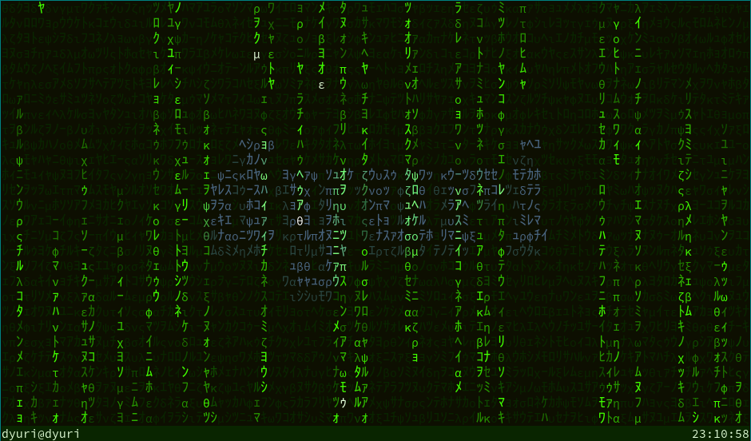

# `repamatrix`

`cmatrix` like terminal *screen saver*



## Install

```
$ pip install repamatrix
```

## Running

```
$ repamatrix
```

### Webcam support

```
$ webcammatrix
```

https://user-images.githubusercontent.com/126637/204153724-ed2dd827-e184-42c5-b20e-5a692267fd2c.mp4

### ... channel it into a virtual webcam

(You most probably need to install some packages, but I'm pretty sure you can manage that.)

Create a `v4l2` loopback device:
```
$ sudo modprobe v4l2loopback devices=1 video_nr=42 card_label="Matrix Camera" exclusive_caps=1 max_buffers=2
```

Start a terminal, get its window id (via `xdotool` or `xwininfo`):
```
$ xdotool getactivewindow
39845902 # this was mine, yours should be different
```

Start the matrix! (`repamatrix` or `webcammatrix`)

Channel your terminal's display into the virtual webcam with gstreamer:
```
$ gst-launch-1.0 ximagesrc xid=39845902 ! video/x-raw,framerate=30/1 ! videoconvert ! video/x-raw,format=YUY2 ! v4l2sink device=/dev/video42
```
(`xid` is the window id)

That's it, you should have a virtual webcam with a view from the matrix!
